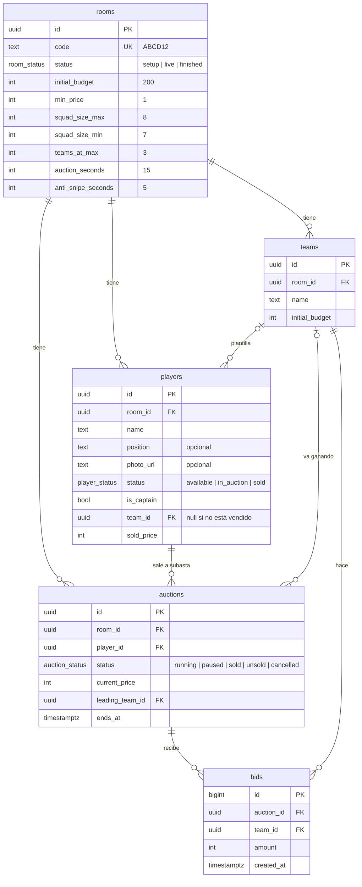

# Modelo de datos

El esquema está en [`supabase/migrations/`](../supabase/migrations/). Todos los importes se guardan en **millones de euros como números enteros** (`20` = 20 M€), para evitar los errores de redondeo de los decimales.

## Diagrama



## Tablas

| Tabla | Qué guarda |
|---|---|
| `rooms` | Una subasta completa y sus reglas: presupuesto, precio mínimo, tamaños de plantilla y tiempos. |
| `teams` | Los 5 equipos. El presidente es el capitán, que es un jugador más. |
| `players` | Los 38 jugadores: los 5 capitanes (ya asignados a su equipo, precio 0) y los 33 que salen a subasta. |
| `auctions` | Cada vez que un jugador sale a subasta. Guarda la puja más alta, quién la tiene y a qué hora termina. |
| `bids` | Todas las pujas, en orden. Es el historial. |

Un jugador puede tener varias `auctions`: si se cancela o nadie puja, vuelve a la lista y puede salir otra vez.

## Reglas de la liga

- **38 jugadores**: 5 capitanes + 33 en subasta.
- **Plantillas dinámicas**: 3 equipos acabarán con 8 jugadores y 2 con 7. Todos pueden llegar a 8 hasta que 3 equipos lo consiguen; a partir de ahí, el resto tiene tope 7.
- **Precio de salida**: 1 M€ para todos.
- **Sin pujas**: el jugador vuelve a la lista.

### Puja máxima

```
puja máxima = restante − (plazas por cubrir − 1) × precio mínimo
```

Cada plaza que quede libre después de esta puja reserva el precio mínimo, para que el equipo siempre pueda completar su plantilla.

| Situación | Tope | Plazas | Puja máxima |
|---|---|---|---|
| Inicio: solo el capitán, 200 M€ | 8 | 7 | 200 − 6 = **194** |
| 7 jugadores, 20 M€ restantes, menos de 3 equipos llenos | 8 | 1 | 20 − 0 = **20** |
| 7 jugadores y ya hay 3 equipos con 8 | 7 | 0 | **no puede pujar** |
| Solo el capitán y ya hay 3 equipos con 8 | 7 | 6 | 200 − 5 = **195** |

La vista `team_standings` calcula todo esto en la base de datos.

## Decisiones de diseño

- **El presupuesto restante no se guarda: se calcula** (inicial − suma de lo pagado). Así, si el administrador corrige una adjudicación, el presupuesto se ajusta solo y nunca puede quedar descuadrado.
- **El contador se guarda como hora de fin (`ends_at`)**, no como "segundos restantes". Cada móvil calcula el tiempo a partir de esa hora, y el cierre lo valida el servidor.
- **Las reglas viven en la base de datos** (restricciones `check`, índices únicos, claves foráneas). Aunque alguien manipule el navegador, PostgreSQL rechaza los datos imposibles: un jugador vendido sin equipo, dos subastas abiertas a la vez, dos capitanes en un equipo…
- **RLS activado en todas las tablas.** Con la clave pública de Supabase nadie puede leer ni escribir nada hasta que definamos permisos concretos.
